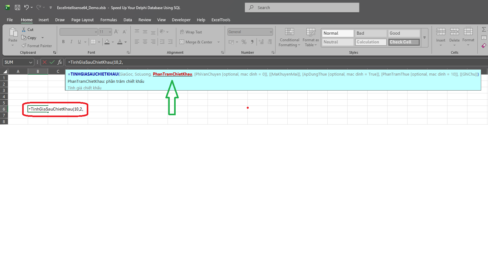

# Excel Intellisense XLL - IntelliSense Tooltip & VBA Function Bridge

Add-in Excel (.xll, hỗ trợ cả **32-bit và 64-bit**) viết bằng Delphi, giúp các hàm VBA tự viết trong workbook có được **tooltip gợi ý tham số** giống hàm gốc của Excel (SUM, VLOOKUP...), và tùy chọn cho phép gọi hàm VBA **như một hàm Excel thật** (xuất hiện trong AutoComplete/Insert Function, có tooltip đầy đủ) mà không cần build lại add-in mỗi khi thêm hàm mới.

> Lưu ý: đây là bản phát hành dạng **binary (.xll đã build sẵn)**. Repo này **không chia sẻ mã nguồn Delphi** của add-in - chỉ chia sẻ file .xll đã build, file demo, và phần cấu hình XML/VBA mà người dùng có thể tự chỉnh sửa để mở rộng hàm của riêng mình.

> **Hướng dẫn đầy đủ (trang web):** [kieumanh366377.github.io/excel-intellisense-xll](https://kieumanh366377.github.io/excel-intellisense-xll/)

---

## 1. Nội dung repo

| File | Mô tả |
|---|---|
| `ExcelIntellisense64.XLL` | Add-in Excel 64-bit đã build sẵn - **không kèm mã nguồn**. |
| `ExcelIntellisense32.XLL` | Add-in Excel 32-bit đã build sẵn (cùng chức năng bản 64-bit, dùng cho Excel 32-bit) - **không kèm mã nguồn**. |
| `ExcelIntellisense64_Demo.xlsb` | Workbook demo, đã import sẵn `modVBAFunctions.bas`, dùng để test nhanh không cần tự setup. |
| `VBAFunctions.xml` | File khai báo danh sách hàm VBA cần có tooltip / đăng ký làm hàm Excel thật. Người dùng tự sửa file này để thêm hàm mới, **không cần build lại .xll**. |
| `modVBAFunctions.bas` | Module VBA mẫu (4 hàm Cong, Tru, Nhan, Chia + 1 hàm test tham số Range là TinhTongCoDieuKien) minh họa cách viết hàm tương thích với add-in. |
| `XLLTool.exe` | Công cụ dòng lệnh (console, hỏi đáp từng bước) để **cài đặt / gỡ cài đặt** add-in tự động - tự nhận diện bản 32-bit/64-bit phù hợp, tự đăng ký add-in với Excel, không cần vào `File > Options > Add-ins` thủ công. Mã nguồn Go đi kèm trong thư mục `Tools/` (`main.go`, `go.mod`, `build.bat`) nếu muốn tự build lại. |

---

## 2. Add-in này làm được gì

### 2.1. Tooltip IntelliSense cho hàm VBA
Khi gõ `=TenHam(` trong 1 ô, add-in hiện 1 tooltip ngay dưới thanh công thức, gồm:
- Tên hàm và danh sách tham số (tham số đang gõ được in đậm/gạch dưới để dễ nhận biết).
- Mô tả của tham số đang gõ.
- Mô tả tổng quát của hàm.
- Nếu tham số tùy chọn có khai báo giá trị mặc định trong XML, tên tham số sẽ hiện kèm giá trị đó ngay trong tooltip, ví dụ `Dieu_Kien [optional, mac dinh = rong]`.
- Hàm nhiều tham số (7-8 tham số trở lên) tự động **xuống dòng** và luôn được **kẹp gọn trong màn hình** đang chứa thanh công thức - không bao giờ tràn ra ngoài mép phải/dưới dù danh sách tham số rất dài.


<p align="center"><i>Tooltip tự hiện khi gõ hàm - tham số đang gõ được in đậm/gạch dưới, kèm mô tả riêng và mô tả tổng quát của hàm.</i></p>

Toàn bộ nội dung tooltip lấy từ file `VBAFunctions.xml` - không cần viết thêm gì trong VBA để có tooltip.

Tooltip cũng tự hiện lại đúng nội dung khi:
- **Click 1 lần** chọn 1 ô đang có sẵn công thức - không cần double-click hay F2, tiện để xem nhanh 1 công thức mà không cần vào chế độ sửa.
- Mở lại file đã lưu rồi bấm vào 1 ô có sẵn công thức để sửa tham số.
- Double-click vào 1 ô đang có công thức, hoặc double-click ngay trên thanh công thức trong lúc sửa - áp dụng ở bất kỳ vị trí nào tooltip có thể hiện.
- Click (hoặc double-click) trực tiếp vào 1 dòng gợi ý trong danh sách AutoComplete - hàm được chọn ngay, tooltip hiện ra như khi dùng Tab.
- Nhấn F2 để sửa công thức có sẵn.
- **Gõ tắt tên hàm khi tiền tố trùng từ 2 hàm trở lên** (ví dụ `=Tinh` khớp cả `TinhGiaSauChietKhau` và `TinhTongCoDieuKien`) rồi bấm Tab - add-in tự đếm đúng số lần bấm mũi tên lên/xuống để biết bạn đang chọn hàm nào, kể cả khi giao diện gợi ý hiện đại của Excel không cho phép đọc trực tiếp. Gõ đủ tên, hoặc gõ tới khi tiền tố chỉ còn khớp duy nhất 1 hàm, luôn cho kết quả chính xác tuyệt đối mà không cần dùng tới mũi tên (xem giới hạn ở mục 6).

### 2.2. Cầu nối gọi hàm VBA như hàm Excel thật (tùy chọn)
Nếu muốn hàm VBA xuất hiện trong AutoComplete/Insert Function của Excel như 1 hàm thật (không chỉ có tooltip khi gõ tay đúng tên), add-in đọc thêm `VBAFunctions.xml` để tự đăng ký hàm đó với Excel. Khi được gọi, add-in chuyển tiếp lời gọi sang đúng hàm VBA cùng tên trong workbook đang mở để lấy kết quả - **logic tính toán luôn nằm ở VBA**, add-in chỉ đóng vai trò cầu nối.

Các cải tiến của cầu nối này:
- Hộp thoại Insert Function (`fx`) xếp hàm vào đúng nhóm (category) khai báo trong XML, thay vì luôn rơi vào nhóm "User Defined".
- Hộp thoại Function Arguments hiện đúng tên từng tham số (argumentText) thay vì "Argument1, Argument2..." chung chung.
- Lỗi từ VBA trả về đúng loại lỗi Excel tương ứng (`#NAME?`, `#NUM?`, `#VALUE!`...) thay vì luôn ép về `#VALUE!`.

Giới hạn của cơ chế cầu nối này:
- Tối đa 50 hàm được đăng ký kiểu này trong 1 lần chạy Excel.
- Tối đa 16 tham số cho mỗi hàm.
- Tham số hỗ trợ cả giá trị thường (số/chuỗi/mảng) và tham chiếu Range thật (đọc được `.Address`, `.Cells`, định dạng...).

---

## 3. Yêu cầu hệ thống

- Windows, Microsoft Excel bản **32-bit hoặc 64-bit** (đã test trên Excel 2024 64-bit / Windows 11, và Excel 2016 32-bit / Windows 10).
- Excel phải cho phép chạy Macro (VBA) và load Add-in .xll.

---

## 4. Cài đặt

### Cách 1 - Dùng XLLTool.exe (khuyến nghị)

1. Tải và đặt các file sau vào **cùng 1 thư mục**:
   ```
   XLLTool.exe
   ExcelIntellisense64.XLL   (và/hoặc ExcelIntellisense32.XLL)
   VBAFunctions.xml
   ```
2. Đóng Excel nếu đang mở (file `.xll` có thể bị khóa nếu Excel đang chạy).
3. Chạy `XLLTool.exe`, chọn `[1] Cai dat add-in`.
4. Nếu thư mục có **cả 2 bản** 32-bit và 64-bit, `XLLTool.exe` tự phát hiện Excel trên máy là bản nào (đọc trực tiếp file `EXCEL.EXE` thật) và gợi ý sẵn - nhấn Enter để dùng gợi ý, hoặc tự gõ `32`/`64` nếu muốn cài bản khác.
5. Nhấn Enter để dùng thư mục cài đặt mặc định (`%LOCALAPPDATA%\ExcelIntellisenseXLL`), hoặc nhập đường dẫn khác.
6. Thấy dòng `"Cai dat thanh cong!"` là xong - mở Excel lên, add-in **tự nạp ngay**, không cần vào `File > Options > Add-ins` thủ công.

Gỡ cài đặt: đóng Excel, chạy lại `XLLTool.exe`, chọn `[2] Go cai dat add-in`, làm theo hướng dẫn trên màn hình (có tùy chọn xóa luôn thư mục đã cài).

### Cách 2 - Cài thủ công (khi không dùng được XLLTool.exe)

**Bước 1 - Chuẩn bị thư mục**
Đặt 2 file sau vào **cùng 1 thư mục**:
```
ExcelIntellisense64.XLL   (hoặc ExcelIntellisense32.XLL tùy bản Excel)
VBAFunctions.xml
```
(có thể đặt bất kỳ đâu, không bắt buộc theo cấu trúc cố định, chỉ cần 2 file này nằm cùng thư mục với nhau)

**Bước 2 - Nạp add-in vào Excel**
Cách 1 - Nạp cố định (khuyến nghị, tự load mỗi lần mở Excel):
1. Mở Excel > `File` > `Options` > `Add-ins`.
2. Ở ô `Manage`, chọn `Excel Add-ins` > bấm `Go...`.
3. Bấm `Browse...`, chọn file `.xll` đúng bản (32-bit hoặc 64-bit) khớp với Excel đang cài.
4. Bấm `OK`, đảm bảo add-in đã được tick chọn trong danh sách.

Cách 2 - Nạp tạm (chỉ dùng cho session hiện tại):
- Double-click trực tiếp vào file `.xll` khi Excel đang mở, hoặc kéo-thả file .xll vào Excel.

### Bước 3 - Thêm hàm VBA của bạn
Áp dụng chung cho cả 2 cách cài đặt ở trên. Có 2 cách để test:

**Cách A - Dùng file demo có sẵn:**
Mở `ExcelIntellisense64_Demo.xlsb` (đã import sẵn `modVBAFunctions.bas`), đảm bảo add-in đã nạp (Bước 2), gõ thử `=Cong(` trong 1 ô.

**Cách B - Dùng workbook của riêng bạn:**
1. Mở workbook cần dùng, nhấn `Alt+F11` để mở VBA Editor.
2. `File` > `Import File...` > chọn `modVBAFunctions.bas` (hoặc module VBA của riêng bạn, xem mục 5 để biết quy tắc viết hàm tương thích).
3. Lưu workbook dạng có Macro (`.xlsm` hoặc `.xlsb`).

> **HotReload:** Add-in tự theo dõi thay đổi của `VBAFunctions.xml` và nạp lại ngay trong vài giây - không cần đóng và mở lại Excel mỗi khi sửa mô tả hàm, thêm/xóa tham số, hay khai báo hàm mới trong XML. Riêng module VBA hoàn toàn mới (bước 2 ở trên) vẫn cần Import vào workbook đang dùng - đây là giới hạn của VBA/Excel, không phải của add-in.

---

## 5. Thêm hàm VBA mới (không cần build lại .xll)

### 5.1. Viết hàm trong VBA
```vb
Private Function TenHam(A As Double, B As Double) As Double
    TenHam = A + B
End Function
```

Lưu ý quan trọng:
- Khai báo hàm là **`Private Function`**, không phải `Public Function`. Nếu để `Public`, Excel sẽ tự động liệt kê hàm này ra làm 1 UDF (User Defined Function) riêng của VBA, gây trùng lặp với hàm mà add-in đăng ký cùng tên - kết quả là gõ `=tenham` sẽ thấy **2 dòng trùng tên** trong gợi ý AutoComplete. Add-in vẫn gọi được hàm `Private` bình thường, chỉ Excel không tự liệt kê nó ra ngoài.
- Hàm phải là `Function` (có giá trị trả về), không dùng `Sub`.
- Tham số có thể là giá trị thường (`Double`, `String`, `Boolean`...) hoặc `Range` (để đọc trực tiếp vùng dữ liệu, định dạng ô...).
- Module VBA chứa hàm phải nằm trong 1 workbook/add-in **đang mở** khi gọi hàm.

### 5.2. Khai báo trong VBAFunctions.xml
```xml
<Function name="TenHam" category="Toan hoc">
  <Description>Mo ta ngan gon chuc nang cua ham</Description>
  <Param name="A">Mo ta tham so A</Param>
  <Param name="[B]" default="0">Mo ta tham so B (tuy chon)</Param>
</Function>
```

Quy ước:
- `name` của `<Function>` và `<Param>` không được để trống.
- Tham số tùy chọn: bọc tên trong dấu ngoặc vuông, ví dụ `name="[Dieu_Kien]"`.
- Thuộc tính `category` trên `<Function>` (tùy chọn) quy định nhóm hiển thị trong Insert Function - bỏ trống thì Excel tự xếp vào nhóm "User Defined".
- Thuộc tính `default` trên `<Param>` tùy chọn (tùy chọn) ghi giá trị mặc định của tham số đó - hiện kèm ngay trong tooltip.
- Thứ tự `<Function>`, `<Param>` trong XML là thứ tự hiển thị trong tooltip.
- 1 `<Function>` hoặc `<Param>` khai báo sai (thiếu `name`, XML lỗi cú pháp...) chỉ bị bỏ qua đúng phần đó, không làm mất tooltip của các hàm còn lại trong file.
- Tên trong thuộc tính `name` chính là tên bạn sẽ gõ trong Excel (ví dụ `name="TenHam"` thì gõ `=TenHam(`), và cũng phải khớp đúng tên hàm VBA thật đã viết ở bước 5.1.

### 5.3. Lưu XML - add-in tự nạp lại
Nhờ HotReload, chỉ cần lưu file `VBAFunctions.xml` là tooltip cập nhật ngay trong Excel đang mở, không cần đóng và mở lại. Riêng module VBA ở bước 5.1 vẫn phải Import vào workbook đang dùng nếu đó là module hoàn toàn mới.

---

## 6. Một số lưu ý khi dùng

- Tooltip dựa trên việc bắt từng ký tự gõ trong thanh công thức, nên trong vài trường hợp gõ/sửa công thức phức tạp (dùng phím mũi tên di chuyển giữa các tham số đã gõ, Delete giữa chuỗi...), tooltip có thể tự ẩn đi thay vì hiển thị sai - đây là hành vi có chủ đích (ưu tiên không hiện tooltip sai hơn là hiện sai).
- Nếu thêm quá 50 hàm vào phần "cầu nối gọi như hàm Excel thật" (mục 2.2), các hàm dư sẽ không được đăng ký làm hàm Excel thật (tooltip khi gõ tay vẫn hoạt động bình thường).
- Hàm có quá 16 tham số sẽ không được đăng ký làm hàm Excel thật vì lý do tương tự.
- Gõ tắt tên hàm khi tiền tố trùng từ 2 hàm trở lên rồi bấm Tab **ngay không dùng mũi tên** đôi khi đoán sai tên hàm hiện trong tooltip (Excel có xu hướng ưu tiên hàm dùng gần đây, không hẳn theo thứ tự A-Z) - đoán sai thì thấy ngay qua chính tên hàm trong tooltip, và công thức vẫn luôn được Excel hoàn tất đúng bất kể tooltip có đúng hay không. Gõ đủ tên, hoặc dùng mũi tên lên/xuống xác nhận đúng hàm trước khi bấm Tab, sẽ luôn chính xác tuyệt đối.

---

## 7. Liên hệ / Đóng góp

Nếu gặp lỗi, có góp ý, hoặc cần hỗ trợ tùy biến thêm cho nhu cầu riêng, liên hệ:

**Kiều Mạnh**
Email: kieumanh366377@gmail.com
Hướng dẫn đầy đủ: https://kieumanh366377.github.io/excel-intellisense-xll/

---
